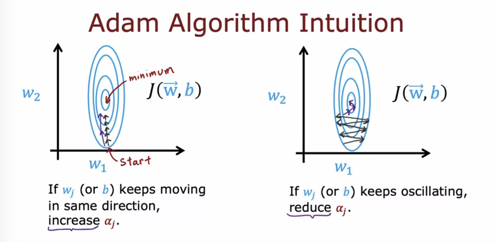

## Activation functions in Neural networks

- ReLU (Rectified Linear Unit)
- Linear activation function (no activation function)
- Sigmoid function

ReLU is almost always preferred for the hidden layer because it is faster. For the output layer, use the activation function corresponding with the outcome of interest

Why use activation functions at all? This would mean we use "**linear activation function**", g(z) = z. It would result with only a linear regression, i.e., a linear function of a linear function is just a linear function. 

Linear activation function for hidden layers and output layer == linear regression output

Linear activation function for hidden layers and sigmoid function for output layer == logistic regression

## Multiclass

Softmax regression algorithm is a generalization of a logistic regression for multiclass target. 

In this case we use the softmax activation function in the output layer. However, the softmax is unique and kind of different from other activation functions above becuase the output of one neuron of the output layer depends on other neurons in the layer. 

The loss function in this case is SparseCategoricalCrossentropy function. 

For multiclass classification, the recommended way to implement softmax regression is to set from_logits=True in the loss function, and also to define the model's output layer with a linear activation instead of a softmax activation.

## Multi-label classification

One option would be to treat the problem as three classification problems, but there is a way to alteratively train one neural network with three outputs

## Advanced optimization

We usually use gradient descent to minimize the cost function but there are other more advanced and faster optimization algorithm. 

**Adam algorithm**: done when every step of the gradient is pretty much going in the same direction; increases the learning rate bigger to get the minimum faster. It can also do the opposite by adaptively adjusting the learning rate (makes it smaller or larger)

## Other types of layers

If we have multiple convolutional layers a NN, we have a convolutional neural network. 

