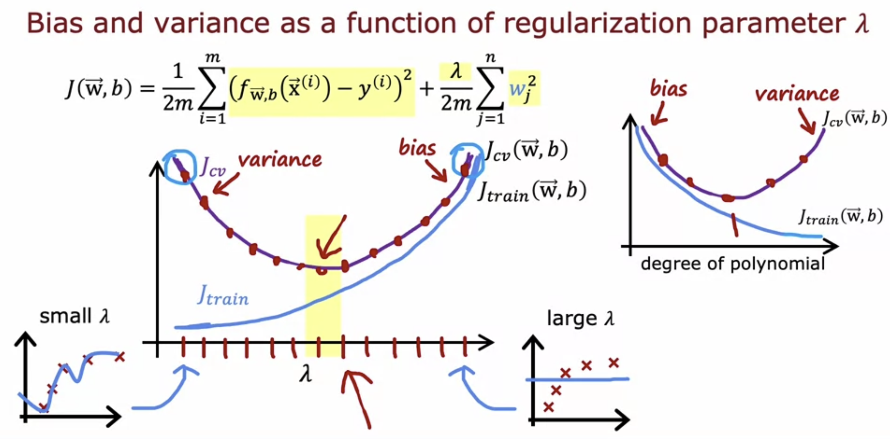

Large errors? 

- get more training examples, **fixes high variance algorithm**
- smaller set of features, **fixes high variance algorithm**
- Get additional features, **fixes high bias algorithm**
- polynomial features, **fixes high bias algorithm**
- decreasing regularization term, lower value for the regularization term. **fixes high bias algorithm**
- increasing regularization term, if we're overfitting so fitting a smoother function will **fix high variance**

This is known as model diagnostics. A diagnostic is a test that you run to gain insight into what is/isn’t working with a learning algorithm, to gain guidance into improving its performance

## Evaluating model performance

Split data into training set, cross validation (dev) set, and test set. All decisions about the most performing model should be made using the first two, and the test set should be used to report the generalization performance of the chosen model

## Bias vs Variance

 High bias: underfit, the cost on train and dev sets is high

High variance: overfit, the cost on train set is low but the cost on dev set is high

Just right: the costs of both train and dev sets are low

## Regularization vs bias and variance

High regularization parameter will result in underfitting, high bias

Small parameter will result in overfitting, high variance

We use cross validation to choose the right regularization parameter

## Learning curves

If an algorithm has high bias, there will be a point where getting more training data won't decrease the error on the dev set. When you have high variance, increasing the sample size will significantly improve the performance of the learning algorithm

## Bias and Variance in neural networks

There is always a trade off between these two concepts, i.e. balances the complexity of the model to get the best performance. 

Large neural networks: result in low bias

A large nn will usually do as well or better than a smaller one so long as regularization is chosen appropriately. One disadvantage is that this is computationally expensive

## Training Learning Algorithms

## Error analysis

Manually examining a set of cross validation examples and categorize them based on common traits. 

## Adding more data

**Data augmentation**: modifying an existing training example to create a new training example. most common in image, speech recognition. This can be done by introducing distortions. The distortion introduced should be representation of the type of noise/distortion in the test set

It usuallyl doesn't help to add purely random meaningless noise to the data

**Artificial data synthesis**: generate new data (eg. in compute vision tasks) in different fonts

## Transfer learning

Use the data from other tasks to enhance your ML algorithm. You make a copy of the already existing nn, e.g. use the first few layers and modify the output layers parameter. There is also a possibility of training all parameters, if you have a somewhat large training data

## Precision vs recall

Precision: of all patients where we predicted y = 1, what fraction actually have the rare disease? TP/#predicted positive. Given we predicted positive class, what is the probability that it is truly positive, PPV

Recall: of all patients that have a rare disease what fraction did we correctly detect as having it? TP/actual positive

These metrics can help us to evaluate the performance of unbalanced classes

F1 score can help you balance both precision and recall. This is found using a harmonic mean of both metrics, giving more weight on whatever value is lower
$$
\text{F1 Score} = \frac{1}{\frac{1}{2}(\frac{1}{P} + \frac{1}{R})} \\
= 2 \frac{PR}{P+R}
$$
