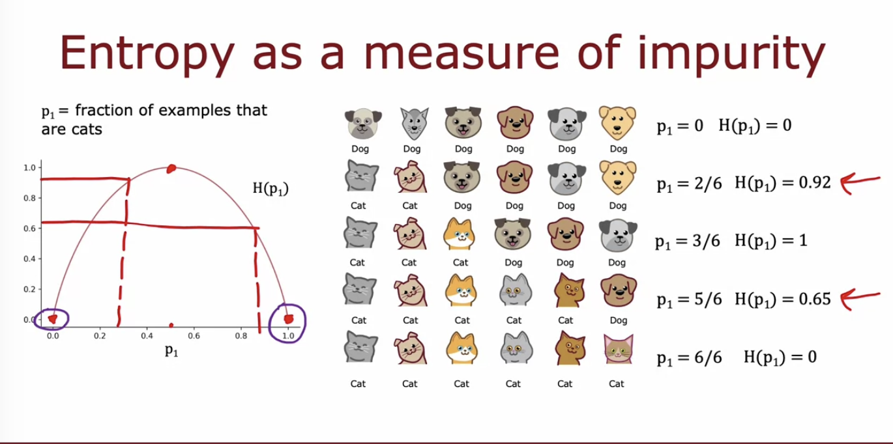
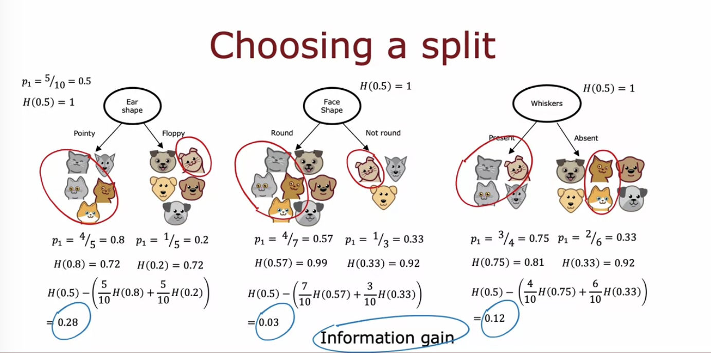
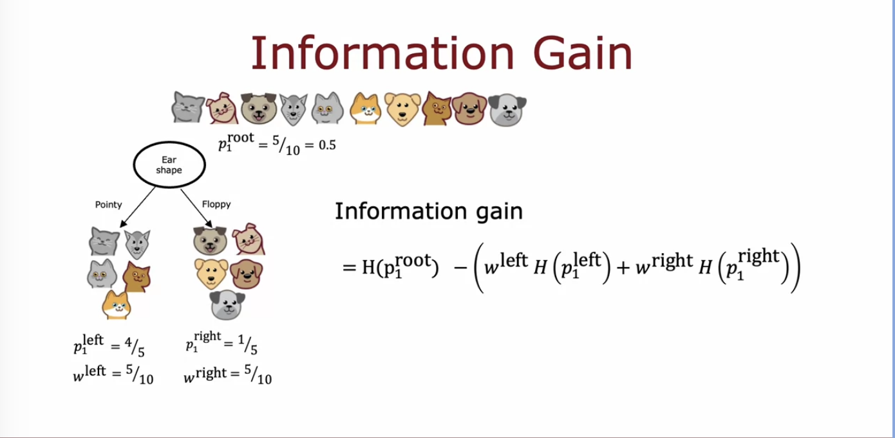
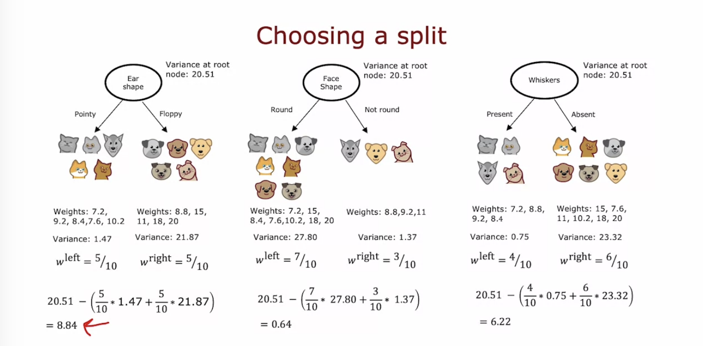
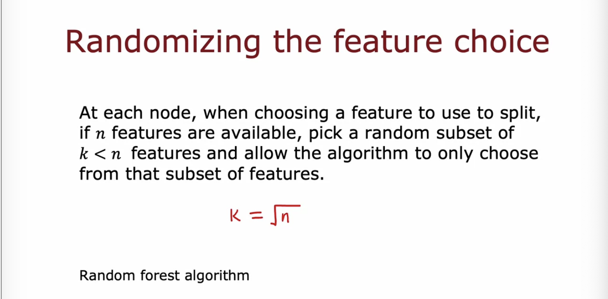

## Decision trees

Root nodes

Decision nodes

Leaf nodes

**Process**:

- Feature to use in the root node
- Focus on left branch to focus which feature to use to split the values
- Focus on right branch

## Decision to be made

- How to choose which feature to split on at each node? 
  - Maximize purity (or minimize impurity) == Only one class or a minimum of classes

- When do we stop splitting? 

  - when a node is 100% class

  - when splitting a node result in the tree excedding a max depth. 

  - When improvements in purity score are below a threshold. Increase depth doesn't result in improvement of purity

  - When a number of examples in a node are below a threshold

## Measuring impurity

Entropy: a measure of the impurity of the dataset

To calculate the entropy $H(p_1)$ of the probability of the proportion of cats in the set, p_1, we take log of 2 just that the peak of the curve is 1 which will improve the interpretation
$$
H(p_1) = -p_1 log_2(p_1) - (p_0)log_2(p_0) \\
= -p_1 log_2(p_1) - (1-p_1)log_2(1-p_1)
$$
To choose which feature to split on, we choose a feature that reduces impurity or entropy. The process of minimizing impurity is known as **information gain**. In other words, this is the reduction in entropy that you get by making the split

The information gain at the root node is calculated as the weighted average of the entropy of both righ and left branch based on the number of examples at each branch

If the reduction in entropy is too small, it is not necessary to split the branch further since it may lead to overfitting

Process:

- Start with all examples at root node
- calculate IG for all possible features and pick one with highest IG
- split dataset according to selected feature, and create left and right branches of the tree
- keep repeating until stopping criteria
  - when node is 100% one class
  - splitting node result in tree exceeding max depth
  - number of examples in a node is below threshold

## Regression trees

Instead of trying to reduce the entropy, we aim to reduce the variance at each split. 

## Multiple decision trees

One disadvantages of using a single decision tree is that any small modification of the data can significantly change the outcome of the model, therefore it is not robust. We fix this by fitting multiple decision trees, i.e., tree ensemble. 

The key building block for building an ensemble tree is to create multiple new training sets using sampling with replacement. This will cause the algorithm to experience a lot of small changes in the data already and make it robust to data modification

For b = 1 to B, use sampling with replacement to create a new training set of size m. Train a decision tree of the new dataset. It is recommended to use B = 100, using much larger number of datasets doesn't meaningfully improve performance. 

Even with replacement, we may end up with the same root node for all or most trees. To prevent this, we randomize the feature choice at each node. This will make a random forest algorithm

WHERE DOES A MACHINE LEARNING ENGINEER GO CAMPING: IN A RANDOM FOREST LOLL 😂

## XGBOOST 

A small modification from the random forest algorithm:

For b = 1 to B, use sampling with replacement to create a new training set of size m. **But instead of picking from all examples with equal probabability (1/m), make it more likely to pick misclassified examples from previously trained trees.** Train a decision tree of the new dataset. It is recommended to use B = 100, using much larger number of datasets doesn't meaningfully improve performance. 

- has good choice of splitting criteria and criteria for when stopping

- Built-in regularization to prevent overfitting

  