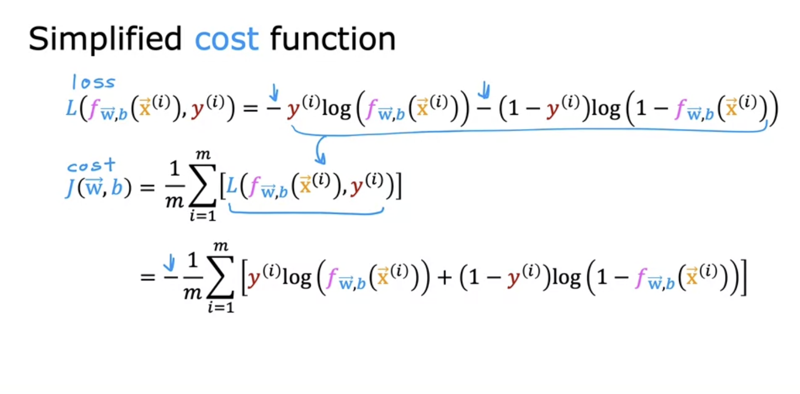
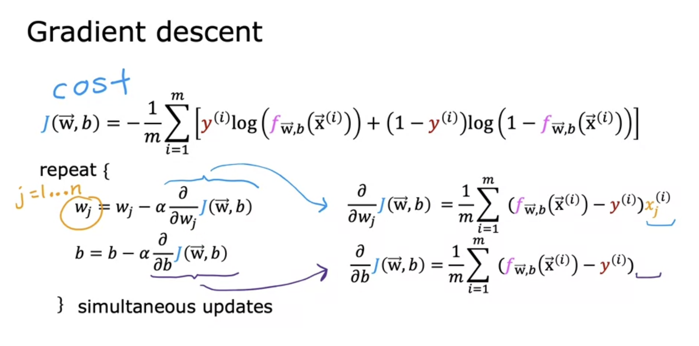

# Classification

## Logistic regression

Linear is not a good algo for classification problems. Examples of classification problem: 

- is email a spam?
- is the transaction fraudulent? 
- is the tumor malignant?

In these questions we have two possible answers, which makes as **a binary classification** problem. 

If we wanted to use linear regression in this, it would not only predict 0 and 1, but also all the values between 0 and 1. One way to do deal with this would be to create a threshold, say 0.5. If the value predicted is greater than 0.5, then we would say it's 1 and 0 otherwise. This however would not work if dataset has outliers, which means we will have too may false predictions because as we the data points shift, the decision boundary also shifts. 

### Malignant or not?

Linear regression is not an algorithm for this problem, instead we will fit an S-shaped curve to the data. **The sigmoid or logistic function** is an important function that drives the logistic regression. It outputs the values between 0 and 1. 
$$
g(z) = \frac{1}{1 + e^{-z}}
$$
When z is a very big, g(z) will be close to 1; on the other hand if it is a very small number, g(z) will be close to 0. 

Now, let's develop the logistic regression algo using the sigmoid function

We first pass the linear function 
$$
z = WX + b
$$
into the sigmoid function, g(z) which will give the value between 0 and 1. 

Putting these equations together will give us
$$
g(z) = g(WX + b) = \frac{1}{1+e^{-(WX+b)}} = f(X) = P(y = 1|X;W,b)
$$
This is the logistic regression model and will output the values 0 and 1. 

f(X) above is the probability of that the label y is 1 given a certain input X or *P(y = 1|X;W,b)*. For example if f(X) = 0.7, it means that there is 70% chance that y is 1 (malignant). 

### Decision boundary

We need to set a threshold when using predictions in logistic regression. This threshold is usually set at 0.5, but it can be changed depending on the problem. 

- When is z greater than 0.5? Whenever z >= 0
- z is greater or equal to zero when WX + b >=0
- Therefore, this will be predicted as y = 1

The decision boundary is where WX+b = 0. We can even have the non-linear decision boundaries if we have high order polynomial features

## Training Logistic regression

### Loss and Cost functions 

Allows us to choose the parameters that best fits the data. The square error cost function is not appropriate for logistic regression since it doesn't give a convex function. If we tried to use gradient descent on this non-convex function, we will have a lot of local minima and it won't converge

The loss function can be simplified as follows:

The cost function used in logistic regression is derived using maximum likelihood estimation and using the loss function above, it can be simplified as follows:

## Gradient descent for logistic regression

As with the linear regression, we use gradient descent to find the parameters w and b that best fit the data (i.e., minimizes the cost function)

SAme as linear regression, we can also monitor gradient descent until it coverges and use vectorization to make sure it converges faster. Also, remember to scale the large range features to make gradient descent run faster

## Underfitting and Overfitting

Underfitting: the algorithm not able to capture the patterns in the data. 

Overfitting: the learning algo does not generalize well to other data, it fits the training data perfectly. It has high variance. The algorithm is trying really hard to fit every single data point in the training set

In ML, we want to balance both underffiting and overfitting. 

### Addressing overfitting

The address overfitting:

- get more data
- reduce number of features to the most relevant features (feature selection)
  - Disadvantage: only a subset of features is used
- Regularization
  - gently reducing the impact (shrinking) of some features without explicitly removing the features
  - you keep all features

## Regularization

If we have too many features, we might not know which features are more important than others; and it would be hard to know which ones to manually penalize. Generally, only the w parameters are penized, not b

We do this by setting a regularization parameter, lambda. If it is zero, the model overfits (that means no regularization), if it is a very big number the model will underfit. This is because for  a model that includes lambda, increasing it will tend to decrease the size of parameters w, therefore giving b more weight and vice versa. 

"Increasing the regularization parameter lambda reduces overfitting by reducing the size of the parameters. For some parameters that are near zero, this reduces the effect of the associated features."

## Gradient descent with regulized linear regression

We add an additional term 
$$
\frac{\lambda}{m}w_j
$$

On every iteration, by adding the regularized term, we are multiplying w_j by another number (less than 1), which will shrink the parameter

