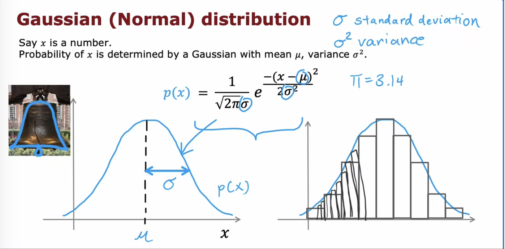
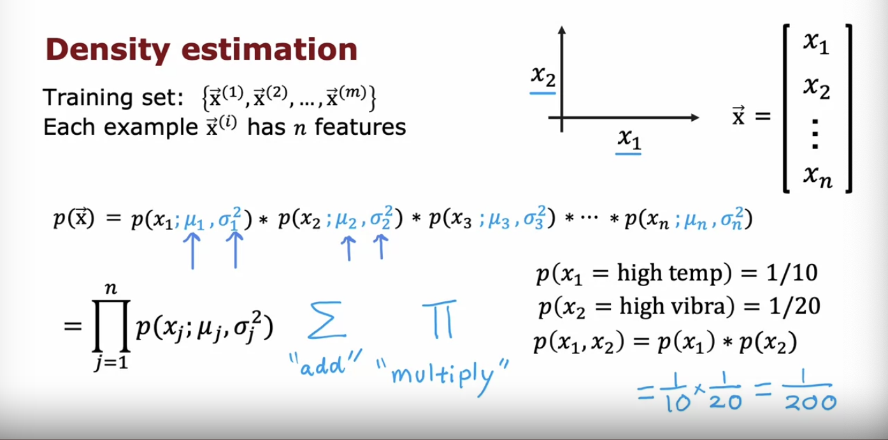

# Clustering

## K-means

- Randomly initialize k cluster points
- Assing the data points to centroids
- If no points were assigned to the cluster, eliminate the cluster
- Take average of each cluster and move centroids to average
- classify each point according to the closer centroid
- If we keep doing this and there are no further changes to the assignment of the points, that means the model has converged and has found the clusters of maximum separation

### Optimization objective

the k-means is trying to find the centroids that minimize the squared distance between the point and the centroid. This is known as the **Distortion function** (it is guaranted to converge, on every single iteration, the function should go down)

When initializing the k-means centroids, the algorithm may be stuck in the local minima and fail to converge depending on the values of the initial values. 

One way to fix this, is to use multiple centroids (k) selected at random, and compute the cost function J of all the choices of classes. Choose the clusters with smallest cost

### Choosing k

- Elbow method: (Andrew doesn't use this)

- Recommended method: what's important to you? How many clusters do you need for your purpose?

# Anomaly detection

The most common technique: **Density estimation**, determines high and low probability values in the training sets. It most commonlly used in fraud detection, detecting fake social media accounts, etc..., anomalous manufaturing products, and monitoring computers in data centres 

We need the normal distribution to apply anomaly detection

The density estimation assumes that the features are statistically independent, but it still does great for dependent features

### Algoritm

Example:

Possible evaluation metric is F1 score, precision and recall. And finally, it is important to use cross validation set to choose parameter epsilon

## Anomaly detection vs Supervised learning

## Choosing features

- Make sure the features are more or less guassian, or transform it to gaussian 
  - e.g., log(x),
  - log(x + c) where c is a constant, 
  - √x
  - REMEMBER TO APPLY THE SAME TRANFORMATION TO THE DEV AND TEST SETS AS WELL
