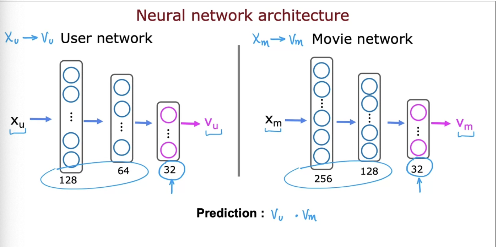

## Recommender system

Mean normalization is important in recommender systems to make sure the algorithm runs faster and more efficiently. This is especially important when for some users, there haven't rated the item yet. This will prevent the algorithm to interpret as if the user gave the iterm a 0 rating

Collaborative filtering: recommmend new items based on ratings of users who gave similar ratings as you

Content-based: recommend based on **features of users and item** to find good match. 

the prediction above may outputs the rating number but if we want to the probability of 1 or 0, we can also apply a sigmoid on the dot product, i.e. g(v_u . v_m)

