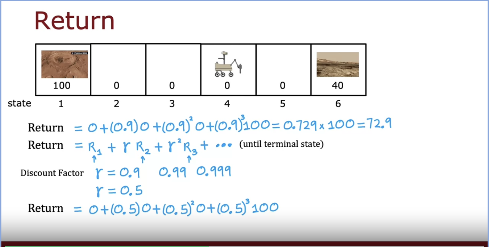
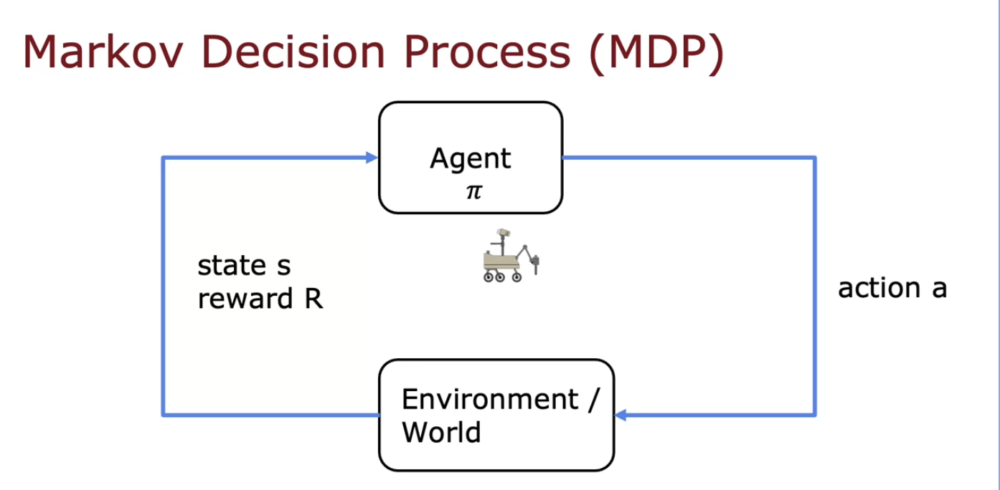

# Reinforcement Learning

The key input for RL is the ***reward function***. Tell the algo what do do instead of how to do it and define the reward function. If it performs well, reward it well and penalize it if it performs poorly. 

***Terminology***:

**State** (s), the location of the algo

**Action**, what the algo chooses to do

**Reward**, the reward enjoyed by the algo by taking a specific action

**New State**, the new location after taking action

The Return: The sum of rewards on each step weighted by the **discount factor** (ranges 0 - 1). This causes the algorithm to get a little bit impatient to get the reward. It gets rewarded more by getting to the reward sooner. A common choice of a discount factor is a number close to 1

The goal is to create a function (**a policy**) whose goal is to take the state (s) and map it to some action (a) so as to maximize the return. This formalism refers to Markov Decision Process (MDP), the future depends on where you are now not how you got here

State-action value function