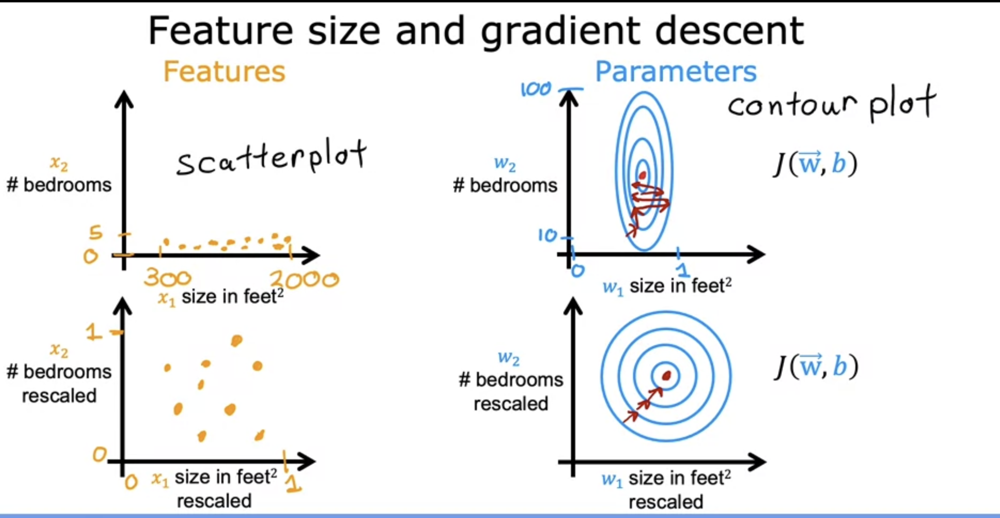
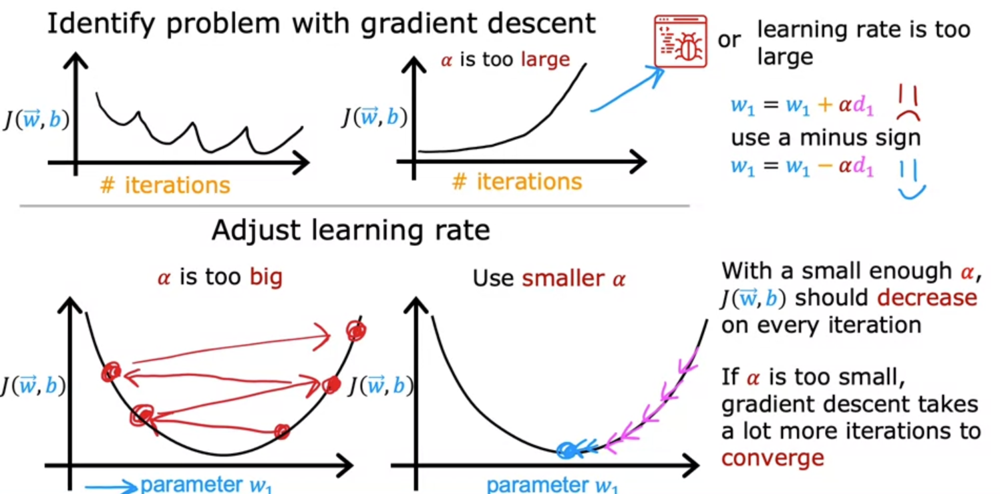

# Multiple linear regression

In this type of the model, we have multiple features such that
$$
f_{wb}(x) = w_1x + w_2x + w_3x + w_4x +.....+w_nx + b
$$
where `n` is the number of features in the dataset. 

Equivalently, the hypothesis function for the multiple linear regression is
$$
f_{wb}(x) = W \cdot X + b
$$
where X is the design matrix of the features and W is the vector of weight parameters and b is the intercept

### Vectorization

To implement the model we can use the dot product of W and X such that

```python
f = numpy.dot(W, X) + b
```

This is much more practical when n is large and more efficient than the for loop or sequential calculation of the model because the numpy dot function uses **parallel hardware** to compute the dot product of the vectors.

Parallel hardware: the computer gets all the values in the two vectors and computes the products at the same time and sums all the resulting numbers at the same time. This makes it much more efficient, especially for a large n

### Gradient descent for multiple linear regression

Below is the gradient descent for when we had only one feature:
$$
w = w - \alpha * \frac{\partial J(w,b)}{\partial w} = w - \alpha * \frac{1}{m} \sum_{i=1}^{m} (\hat{y}^{(i)} - y^{(i)})x^{(i)} \\

b = b - \alpha * \frac{\partial J(w,b)}{\partial b} = b - \alpha * \frac{1}{m} \sum_{i=1}^{m} (\hat{y}^{(i)} - y^{(i)})
$$
where w and b are simultaneously updated to find the values that will result in a model that best fits the data. Since for the multiple linear regression we do have multiple features, we will have `n` number of equations to update, where n is the number of features. 
$$
w_j = w - \alpha * w - \alpha * \frac{1}{m} \sum_{i=1}^{m} (\hat{y}^{(i)} - y^{(i)})x^{(i)}_j \\
\text{for j = 1, 2, 3, 4, ..., n}
\\b = b - \alpha * \frac{\partial J(w,b)}{\partial b}
$$

Like before, in this algorithm the parameters, w and b are  repeatedly and simultaneously updated after taking into account the learning rate until convergence (i.e. until we reach the global minima --> the function that fits the data best). 

There is an alternative way to minimize the cost function: ***Normal equation***. Use it to solve for w, b without iterations. However, this is only used for linear regression and it is slow for a large n. Some libraries use this in the back end to implement the linear regression

## Feature scaling

This method will help the gradient descent to run faster. The continuous variables in the dataset have different scales (for example, house size in sq. feet vs number of bedrooms). 

When a possible range of values is large (eg. 20-2000), a good model will choose a relatively small of the parameter, and vice-versa. For the example of house size in square feet, a very small change in the parameter will change the outcome value (e.g. price), therefore a huge change in the the cost function. 

- Therefore, using the dataset with varying ranges of values will lead to tall and skinny contours, gradient descent will end up bouncing back and forth before it reaches the global minimum. Scaling the data on the same scale so they take up a comparable range of values will solve this issue. 



- Methods to scale

  - Divide by the maximum the feature to scale between 0 and 1

  - Mean normalization: 
    $$
    \frac{x_1 - \mu_1}{max - min} \\
    \text{where $\mu_1$ is the mean of the feature and $x_1$ is the value we want to scale}
    $$

  - Z-score normalization
    $$
    \frac{x_1 - \mu}{\sigma} \\
    \text{where $\mu$ and $\sigma$ are the mean and standard deviation, respectively}
    $$

- As a rule of thumb, scale the values that have the range that are reallly small and really large. When in doubt, scale. There is no harm in doing so.

## Is gradient descent converging?

Reminder: gradient descent's purpose is to find the parameters, w and b, that minimize the cost function. 

- Plot the cost function vs number of iterations of the gradient descent. This is called a **learning curve**. 
  - If the gradient descent is working properly, the cost function should decrease after every iteration. 
  - If it is increasing at any iteration, it may be a poor choice of a learning rate. 
  - The iterations needed to converge depend on a particular problem and model. 
- Automatic convergence test
  - Define a small number such as 0.001. If the cost decreases less than the small number specified, you can declare converge (i.e., found parameters to get close to global minimum). 
  - This may be unreliable sometimes because you have to depend on your own defined number for the test

## Let's choose an appropriate learning rate

If it is too small, the gradient descent will be slow; if it is too large, the algorithm may never converge (because it will overshooting the global minima often).

 

Choose different values of `alpha` such as **0.001, 0.003, 0.01, 0.03, 0.3, 1**. Try until we find a value too small and too large so we can find the just right learning rate. 

## Feature engineering

How do we choose the most appropriate feature for our learning algorithm? This is a process of using intuition and knowledge to design new features by transforming or combing the existing features. This might help you to get a much better predictive model. 

This might help us to fit non-linear curves to the data using polynomial regression

	### Polynomial regression

Not all problems with a continuous outcome can be modelled using a linear curve. This is where polynomial regression comes in. For example a cubic polynomial regression can be something like
$$
f_{w,b} (x) = w_1x + w_2x^2 + w_3x^3 + b
$$
*when we do this, feature scaling becomes increasingly important because we have very different ranges of values.* 

How do we decide which features to use? This will be discussed in course 2. 